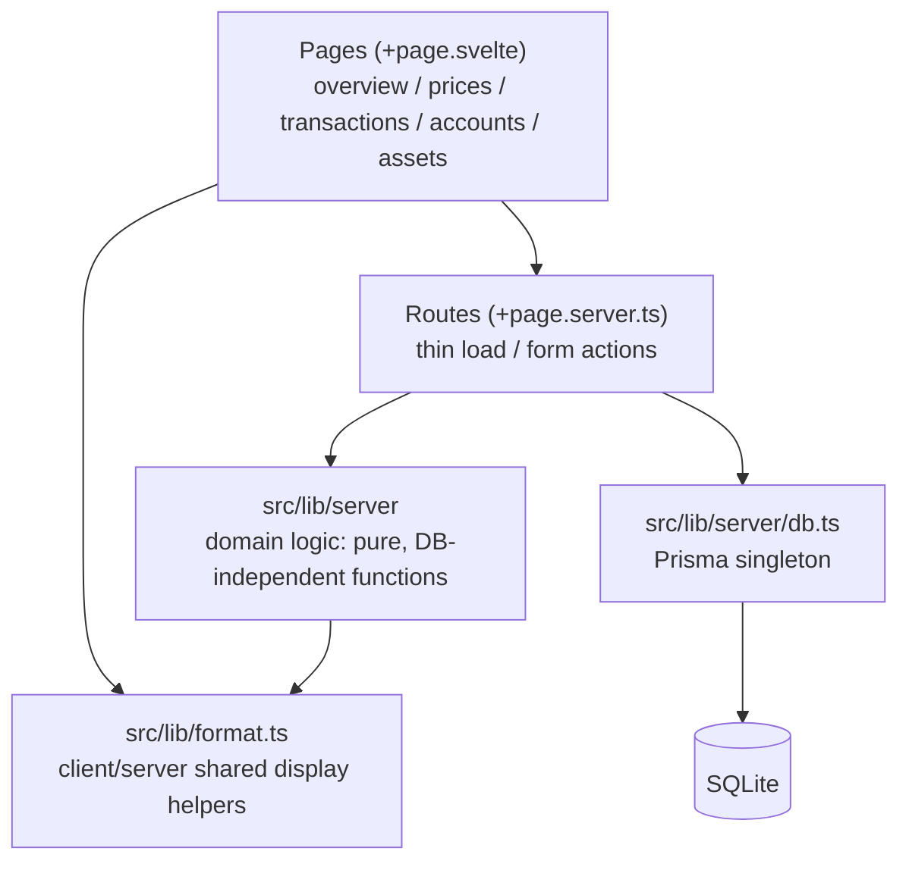

# Architecture Overview

A one-page map of how this codebase is organized and why.
This document describes **structure and rules**, not implementation details —
the source of truth for details is always the code: `prisma/schema.prisma`
for the data model, `src/lib/server/` and its co-located `*.spec.ts` files
for behavior, and `docs/adr/` for the reasoning behind decisions.

## The two structural rules

The project stays on the standard SvelteKit layout (`sv create`, single
package at the repository root). On top of that, only two rules apply:

1. **Database access and domain logic live in `src/lib/server/`.**
   SvelteKit enforces that `lib/server` modules can never be imported from
   client code, so the framework's server-only boundary doubles as the
   design boundary.
2. **Routes stay thin.** `load` functions and form actions only fetch data,
   call functions from `lib/server`, and pass results along. No business
   logic in routes.

Features are merged into `main` as small vertical slices
(schema → logic → page). Adding horizontal layers or packages is
intentionally avoided.

## Layers

Two properties of this layering are load-bearing:

- **Domain functions are pure and DB-independent.** They accept plain
  objects (TypeScript's structural typing lets Prisma rows pass through
  unchanged), so all domain tests run without a database.
- **`format.ts` is the only shared module outside `lib/server`**, because
  Svelte components also import it and `lib/server` is not importable from
  the client.

## Module map

| Module (`src/lib/server/`)                                    | Role                                                                                    |
| ------------------------------------------------------------- | --------------------------------------------------------------------------------------- |
| `types.ts`                                                    | Union types + type guards for the string-typed enums (single source for values)         |
| `holdings.ts`                                                 | Derive positions and cash balances from the transaction ledger                          |
| `valuation.ts`                                                | Derive market value (quantity × latest price)                                           |
| `overview.ts`                                                 | Aggregate for the overview page (grouping, latest price selection, per-currency totals) |
| `prices.ts` / `transactions.ts` / `accounts.ts` / `assets.ts` | Pure form validation per page                                                           |
| `forms.ts`                                                    | Shared form-parsing helpers                                                             |
| `db.ts`                                                       | Prisma client singleton (kept out of domain modules so tests stay DB-free)              |

## Core design decisions

Each decision is recorded as an ADR in `docs/adr/`; the short version:

- **No holdings table** — quantities, cost basis and cash balances are
  derived from the transaction ledger on every read. One source of truth
  (ADR 0002).
- **Money is an integer in minor units** — JPY in yen, USD in cents.
  No floats, no decimals (ADR 0003).
- **Enum-like columns are strings** validated by union types in `types.ts`,
  because SQLite has no enum type (ADR 0004).
- **Moving average uses total-amount apportionment** — multiply before
  dividing, round once — so zero quantity always means zero cost basis
  (ADR 0005).
- **Single-entry bookkeeping** — buying a security does not move cash;
  cash is tracked only by explicit deposits/withdrawals (ADR 0006).

## Write-path pattern: two-stage validation

Every registration form follows the same pattern:

1. **Format validation** — a pure function in `lib/server` checks the
   submitted fields and returns all errors at once; the action responds
   with `fail(400)` plus the submitted values, and the page re-renders
   with errors and inputs preserved (`use:enhance`, works without JS).
2. **Ledger simulation** (transactions only) — the candidate row is
   appended to the existing ledger and the derivation functions are run.
   If they throw (overselling, overdraft, backdated inconsistency), the
   registration is rejected. The derivation functions themselves are the
   single implementation of the ledger invariants.

## Invariants

| Invariant                                                           | Enforced by                                              |
| ------------------------------------------------------------------- | -------------------------------------------------------- |
| Zero quantity ⇔ zero cost basis                                     | Total-amount apportionment in `holdings.ts` (ADR 0005)   |
| The ledger is always derivable (no overselling / negative balances) | Ledger simulation at registration + fail-fast derivation |
| One price per asset × date                                          | DB unique constraint + upsert                            |
| Transaction currency always equals the asset's currency             | Currency taken from the asset, never from the form       |
| Amounts and prices are positive 32-bit integers                     | Form validation + assertions in derivation               |

## Where to look next

- Why a decision was made → `docs/adr/`
- Data model → `prisma/schema.prisma`
- Behavior → the module and its co-located `*.spec.ts`
- Contribution rules → `.github/CONTRIBUTING.md`
